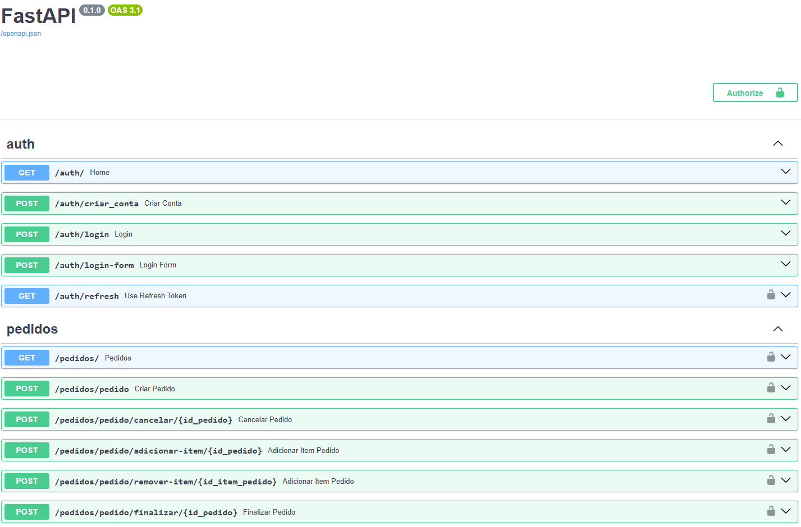

# 🍕 FastAPI Pizzaria Order System

Este é um projeto de *backend* desenvolvido em **Python** utilizando o *framework* **FastAPI** para demonstrar a construção de um sistema de pedidos (CRUD) e autenticação de usuários (JWT). O sistema simula uma API para uma pizzaria, permitindo a gestão completa de pedidos, itens e status.

Este projeto é ideal para quem busca entender a integração entre FastAPI, Pydantic, SQLAlchemy e as boas práticas de desenvolvimento assíncrono.

## ⚙️ Tecnologias Utilizadas

* **Framework:** FastAPI
* **Banco de Dados:** SQLite (padrão) / PostgreSQL (recomendado para produção)
* **ORM:** SQLAlchemy (Síncrono)
* **Validação:** Pydantic
* **Autenticação:** JWT (`python-jose`)
* **Criptografia:** `passlib` (para senhas)
* **Ambiente:** `dotenv`

## 🚀 Principais Recursos da API

* **Autenticação JWT (JSON Web Tokens):** Gerenciamento seguro de acesso com *Access* e *Refresh Tokens*.
* **Gestão de Pedidos:** Endpoints para criação, visualização, adição de itens, cancelamento e finalização de pedidos.
* **Controle de Acesso (RBAC Simples):** Definição de rotas exclusivas para usuários com privilégios de `admin`.
* **SQLAlchemy ORM:** Utilização do SQLAlchemy para modelagem de dados e interação.
* **Pydantic Validation:** Validação rigorosa de dados de entrada e serialização de respostas.

## 💡 Primeiros Passos

### Pré-requisitos

Você precisará ter o Python instalado (versão 3.8+ é recomendada).

### 1. Clonar o Repositório

```bash
git clone [https://github.com/SEU_USUARIO/fastapi-pizzaria-order-system.git](https://github.com/SEU_USUARIO/fastapi-pizzaria-order-system.git)
cd fastapi-pizzaria-order-system
```
### 2. Instalar Depedencias

pip install -r requirements.txt

### 3. crie seu arquivo.env: 

cp .env.example .env

SECRET_KEY="SUA_CHAVE_SECRETA"
ALGORITHM="HS256"
ACCESS_TOKEN_EXPIRE_MINUTES=30
DATABASE_URL="sqlite:///banco.db"

### 4. Crie o banco de dados :

#### criar a migração: 
alembic revision --autogenerate -m "migracao inicial"
#### executar a migração: 
alembic upgrade head

### 5. execute a api :

uvicorn main:app --reload

A API estará disponível em http://127.0.0.1:8000


📚 Documentação Interativa
O FastAPI gera automaticamente uma documentação interativa.

Swagger UI : Acesse http://127.0.0.1:8000/docs


